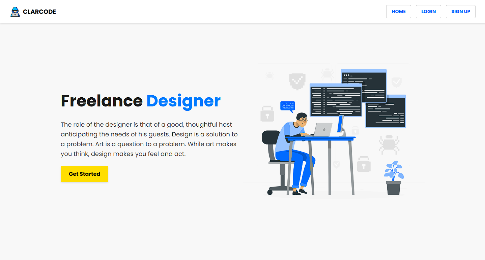
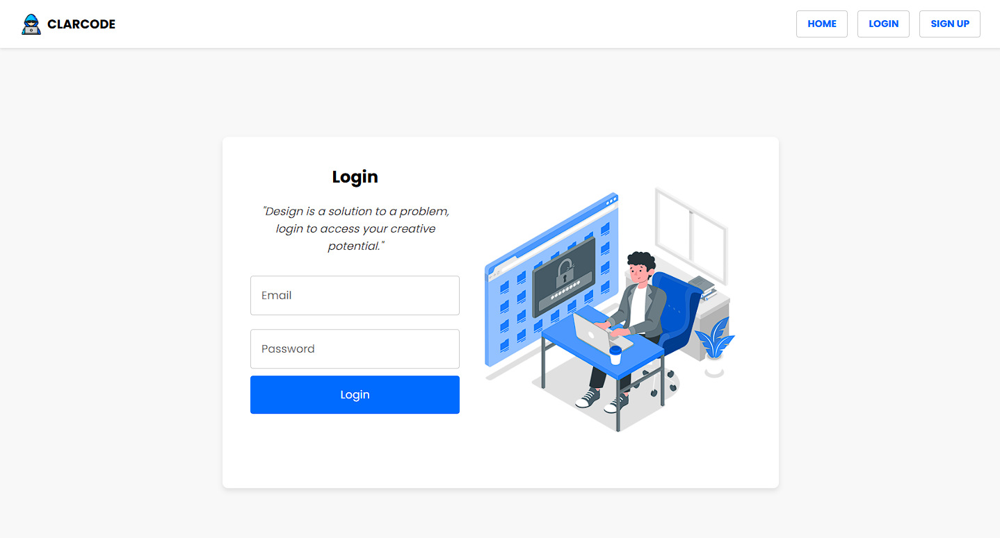
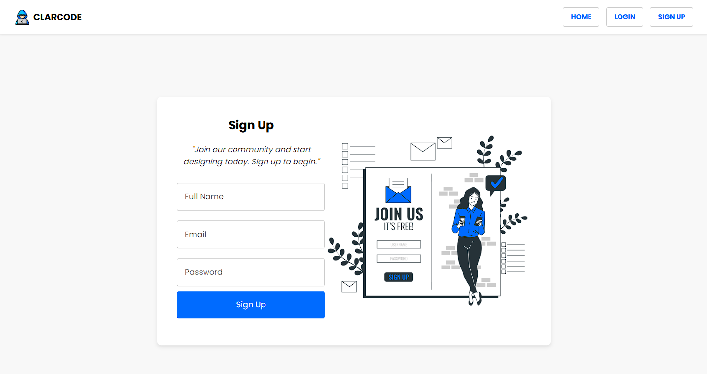
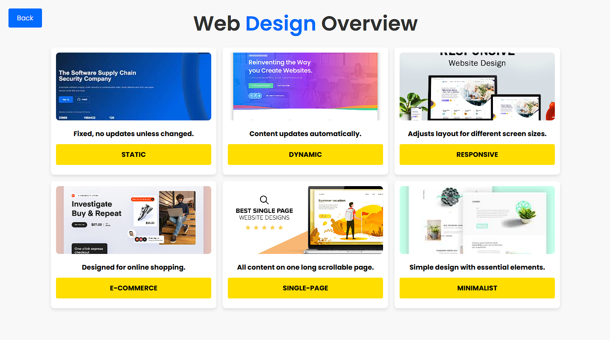
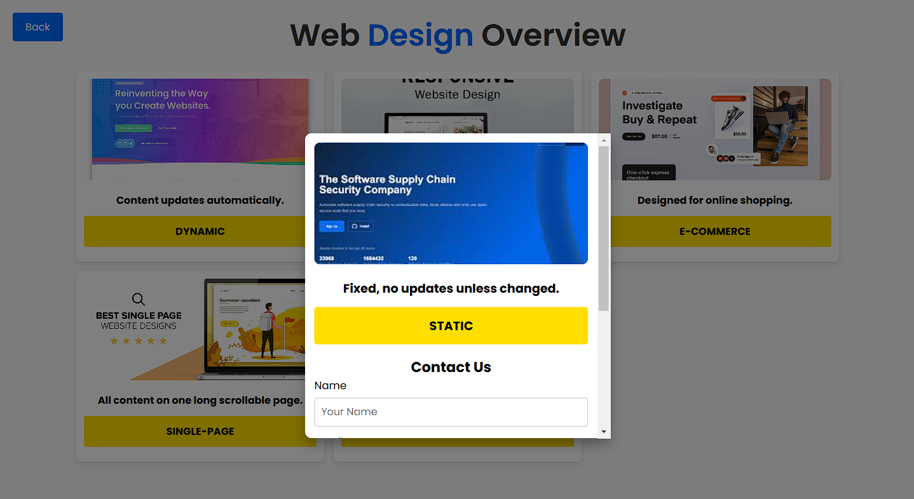

# Freelance Designer Website

## Overview

This project showcases a web-based freelance designer platform that allows users to log in, sign up, and explore various web design templates. The site also features a dynamic card layout with different design approaches and a contact form for each card. The goal of this website is to provide an interactive, informative, and visually appealing experience for users interested in design services.

---

## Features

### 1. **Homepage**
   - **Logo & Branding**: Displays the CLARCODE logo.
   - **Navigation**: Users can navigate to the homepage, login page, and signup page.
   - **Hero Section**: Features an introduction to freelance design with a call-to-action button to get started.

   

### 2. **Login Page**
   - Users can log in with their email and password.
   - Features an inspirational quote on design.
   - A login form is displayed alongside a login illustration.

   

### 3. **Signup Page**
   - Users can sign up by providing their name, email, and password.
   - Features a motivational quote for new users to join the community.
   - A signup form is displayed alongside a signup illustration.

   

### 4. **Card Layout**
   - The site features a **Card Section** that includes 6 different types of web design approaches:
     - **Static**: Fixed design, with no updates unless changed.
     - **Dynamic**: Content updates automatically.
     - **Responsive**: Adjusts layout for different screen sizes.
     - **E-commerce**: Designed for online shopping.
     - **Single-Page**: All content displayed on one long scrollable page.
     - **Minimalist**: Simple design with only essential elements.
   - Each card has a contact form to allow users to inquire about the design approach.

   

### 5. **Contact Form**
   - Each design card features a contact form for users to inquire about the design type.
   - Fields include name, email, and message, with a submit button to send the inquiry.

   

---

## Technologies Used

- **HTML5**: Markup for webpage structure.
- **CSS3**: Styling for responsive layouts and UI elements.
- **JavaScript**: Interactive elements like form submissions, card toggling, and navigation.

---

## File Structure

```plaintext
/ (Root Directory)
│
├── assets/                  # Contains images for illustrations and cards
│   ├── hacker.png
│   ├── Secure login-amico.png
│   ├── SignUp.png
│   ├── Code typing-rafiki.png
│   ├── static.jpg
│   ├── dynamic.jpg
│   ├── responsive.jpg
│   ├── ecomerce.jpg
│   ├── Singlepage.jpg
│   ├── minimalist.jpg
│   ├── HomepageSS.png       # Screenshot of the homepage
│   ├── LoginSS.png          # Screenshot of the login page
│   ├── SignupSS.png         # Screenshot of the signup page
│   ├── CardSS.png           # Screenshot of the card layout
│   └── ContactSS.png        # Screenshot of the contact form
│
├── Homepage.html            # Homepage with navigation and hero section
├── Cardview.html            # Card layout with different design types
├── Home.js                  # JavaScript file for homepage interactions
├── Cardview.js              # JavaScript file for card interactions and form submissions
├── Homestyles.css           # CSS styles for the homepage
└── Cardview.css             # CSS styles for the card layout and contact forms
